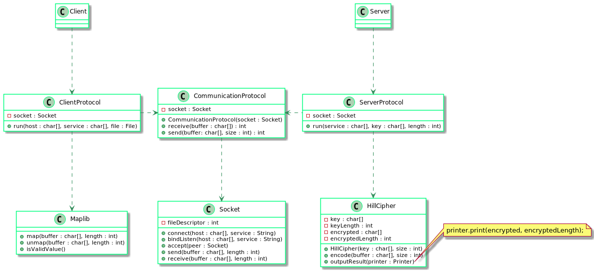
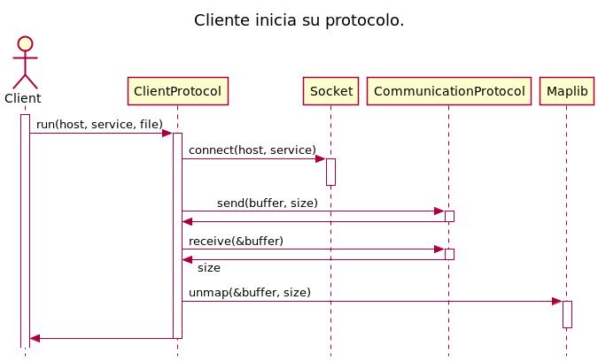
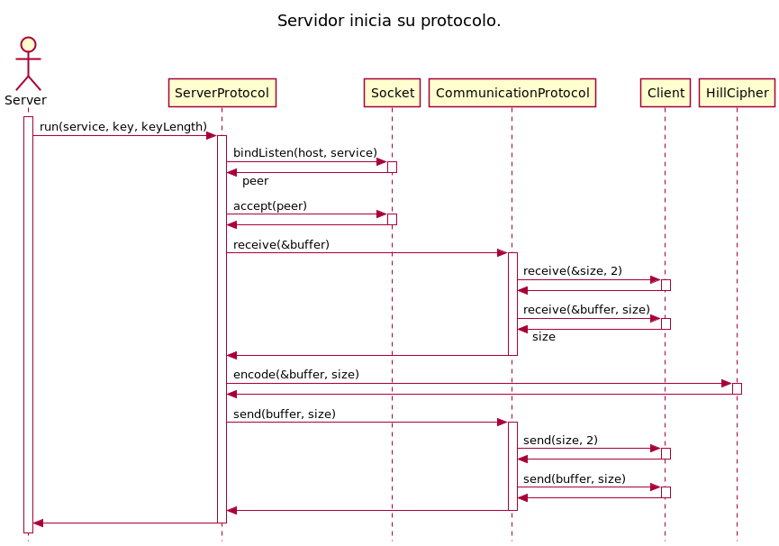
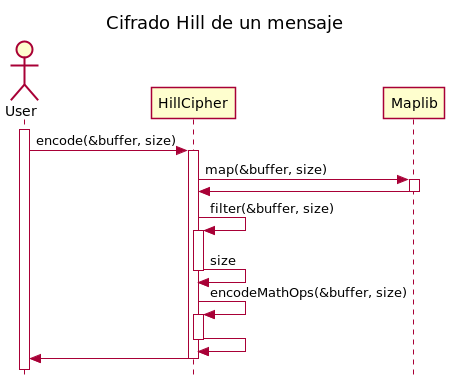

# TP1: Hill Cipher #
**Autor: Daniel Alejandro Lovera L?pez**  
**N?mero padr?n: 103442**  
**[https://github.com/DanieLovera/tp1](https://github.com/DanieLovera/tp1)**  

---
### Introducci?n ###  
Este trabajo consiste en el desarrollo de un programa cliente-servidor  en el cual, el cliente lee l?nea a l?nea un archivo de texto plano para luego enviarlas al servidor y este se encarga de encriptarlas usando un cifrado conocido como ***Hill cipher***. Este se basa en la sustituci?n de caracteres usando ?lgebra lineal modular, es similar al cifrado Cesar (***Cesars Cipher***) porque consiste en un cifrado basado en desplazamiento de caracteres pero este  extiende el concepto a N dimensiones. Luego de que el servidor haya encriptado la l?nea del cliente la devuelve al cliente quien debe encargarse de desmapear (por desplazamiento) el cifrado y mostrar el resultado obtenido.
Este programa se encuentra dise?ado principalmente en 4 grandes bloques que son independientes unos de otros:  
  
- **Cliente**  
- **Protocolo de comunicaci?n**  
- **Servidor**  
- **Cifrado Hill**  
  
Cada uno de ellos tambi?n tienen cierto nivel de abstracci?n internamente, pero estos son los m?dulos claves del trabajo.  

---
### Desarrollo ###  
  
En esta secci?n se presentan detalles de implementaci?n sobre los cuatro m?dulos principales junto con algunos diagramas que tienen como objetivo ayudarle al lector a entender el dise?o propuesto.  
  
> Previo a continuar con el trabajo, el lector debe saber que los diagramas UML presentados en esta secci?n no son una representaci?n exacta de la implementaci?n que se encuentra en el repositorio. Existen diferencias en nombres, firmas, tipos de datos o simplificaciones en los diagramas de secuencias, por lo cual estos diagramas tratan de ser un poco mas gen?ricos y abstractos para que el dise?o del programa pueda ser entendido y reproducido por el lector en cualquier otro lenguaje de programaci?n. Por su puesto esta generalizaci?n no evita que el c?digo presentado sea fiel a los diagramas.  
  
A continuaci?n se presenta un diagrama UML de clases que representa al modelo y se hacen explicitos algunos modulos extras empleados en el dise?o.  
  

####Modelo del programa####  
  

  
En este diagrama se pueden observar las relaciones entre clases y la independencia entre ellas:  
  
- Los **protocolos cliente** y **servidor** no conocen al protocolo de comunicaci?n, su unica responsabilidad sera ejecutar los programas cliente y servidor. De la comunicaci?n entre ellos se encarga el protocolo de comunicaci?n quien es el que conoce como se enviar?n y recibiran datos del cliente al servidor y viceversa.  
- El **protocolo cliente** debe desmapear el resultado enviado como respuesta por el servidor y para esto utiliza una  librer?a llamada **Maplib**, con esto se evita que el cliente conozca directamente la interfaz del **Hill Cipher** y a su vez se elimina la responsabilidad de mapear al cipher.
- El **protocolo servidor** debe cifrar el mensaje enviado por el cliente adem?s de implementar las funciones que debe ejecutar el servidor por lo cual delega la responsabilidad del cifrado sobre el **Hill Cipher** y por eso utiliza su interfaz publica.  
- El **protocolo de comunicaci?n** es el encargado de conocer como se transmiten los mensajes entre ambos extremos de la comunicaci?n e internamente debe utilizar un **Socket** para realizar efectivamente la transmici?n de datos:   

    1. El protocolo de envio consiste en realizar un primer envio con la cantidad de bytes que se enviaran en formato big endian de dos bytes y luego enviar el mensaje real.
    2. El protocolo de recepci?n consiste en realizar una primera recepci?n con la cantidad de bytes que se recibiran en formato big endian de dos bytes y luego recibir el mensaje real.  

En s?ntesis si se quisiera reemplazar el *protocolo de comunicaci?n* establecido se podr?a hacer respetando la interfaz publica de send y receive que entienden el servidor y el cliente. De la misma manera se podr?a cambiar el socket que se utiliz? en la comunicaci?n (en este caso un socket para TCP) y trabajar con otro protocolo de transmisi?n de datos sin afectar al *protocolo de comunicaci?n* e incluso se puede cambiar el tipo de *cifrado* que utiliza el servidor, pero esto llevar?a un poco de mas de trabajo pues el cliente al tener que desmapear los resultados enviados por el servidor quedo ligeramente acoplado al tipo de cifrado que se use, ya que si este utilizara otro tipo de mapeo entonces tambi?n se deber?a cambiar el m?dulo de mapeo correspondiente.  
  
####Cliente####  
  
El cliente es uno de los programas principales, utiliza el m?dulo **protocolo cliente** para iniciar su ejecuci?n por lo cual este tiene las siguientes responsabilidades:  
  
- Conectarse al servidor conociendo el dominio y el servicio de este.  
- Leer desde un archivo de texto o por entrada est?ndar los datos que se enviar?n al servidor.  
- Enviar los datos al servidor y esperar por una respuesta.
- Recibir los datos del servidor.
- Desmapear los datos del servidor.
- Mostrar los datos por salida est?ndar.

A continuaci?n se presenta un diagrama de secuencia que representa esta secuencia de pasos a trav?s de los distintos m?dulos:  
  
  
  
La ?nica responsabilidad que le quedo al protocolo de cliente y que no fue representada en el diagrama fue, la lectura del archivo de texto o de entrada est?ndar. Esta consiste en utilizar la funcion **getline** de la librer?a estandar de C para leer y repetir el procesamiento de (envio, recepcion y desmapeo) hasta terminar el archivo pues tiene el beneficio de incluir siempre el caracter ©\n© dentro de la l?nea le?da. El resto es delegado en otros m?dulos.  
  
####Protocolo de Comunicaci?n####  
  
El protocolo de comunicaci?n permiti? desacoplar los m?dulos Protocolo Cliente y Protocolo Servidor, pues si no estuviera esta interfaz en medio de ambos protocolos el Cliente sabr?a como enviar datos al servidor pero tambi?n tendr?a que saber como los recibe, y esto implica conocer como el servidor le envia respuestas a sus peticiones. Por esta raz?n se coloco este m?dulo entre ambos, para que sea el traductor entre ambos extremos, de esta manera el protocolo cliente y servidor solo entienden dos mensajes de la interfaz p?blica del protocolo de com?nicaci?n:  
  
- Enviar un flujo de datos.
- Recibir un flujo de datos.
  
Ahora cliente y servidor no saben nada de las comunicaciones de esto se encarga el protocolo de comunicaci?n.  
  
  
  
  
  
Los diagramas de secuencia ponen de manifiesto como funciona el protocolo, internamente sigue delegando responsabilidades sobre el **Socket** y al no tener responsabilidades adicionales ni dependencias es un m?dulo de alto nivel y es f?cil de reemplazar.

####Servidor####  
  
El cliente es uno de los programas principales, utiliza el m?dulo **protocolo servidor** para iniciar su ejecuci?n por lo cual este tiene las siguientes responsabilidades:  
  
- Bindear un socket pasivo en la maquina local sobre un servicio.
- Aceptar una conexion entrante del cliente.
- Recibir los datos del cliente.
- Cifrar los datos.
- Enviar los datos devuelta al servidor.
  
A continuaci?n se presenta un diagrama de secuencia que representa los pasos del servidor a trav?s de los distintos m?dulos:  
  
  
  
En este caso el protocolo servidor no tiene ninguna otra responsabilidad, toda es delegada, pero puede existir el problema de, øcomo obtener los datos una vez que el cifrado haya terminado? Debido a que el m?dulo del cipher no tiene permitido modificar los datos que quiere encriptar, entonces internamente debe implementar una forma de poder sacarlos sin generar acoplamiento, esto se solucion? con un callback que ejecutar?a en protocolo del servidor pero seria llamado internamente en el cipher, en la siguiente secci?n se explicar? este detalle.
  
####Hill Cipher####  
  
El cifrador junto con el **Socket** son los m?dulos mas complejos del programa. En ellos se concetra la mayor?a de la l?gica del programa, la complejidad del cipher reside en la variaci?n del tama?o del buffer de entrada, es decir la relaci?n entre cantidad de datos a cifrar y cantidad de datos cifrados no es 1 a 1, el resultado facilmente puede ser un buffer mas grande o mas peque?o dependiendo del tama?o de la clave o la cantidad de datos que sean filtrados del buffer inicial. Por esto motivo se decidi? trabajar con memoria din?mica y adem?s como se mencion? en la secci?n anterior, asegurar que el buffer de entrada al cipher no pueda ser modificado ya que no se puede codificar sobre el mismo buffer porque el resultado podr?a ser de mayor tama?o.  

Continuando con el tema introducido en el server protocol, el hecho de no poder modificar el buffer de entrada obliga a que la implementaci?n del cipher deba permitir extraer estos datos, y para hacerlo de forma gen?rica el cipher perimte que cualquier m?dulo que requiera utilizar los datos cifrados lo pueda hacer seg?n corresponda. En este caso el protocolo del server implemento una funcion que envia estos datos a trav?s del protocolo de comunicaci?n.

**Funci?n que permite la salida del resultado a cualquier m?dulo.**
¡¡¡
    void hill_cipher_output_result(hill_cipher_t *self, 
    							   ssize_t (*callback)(void *context, 
    										 		   const unsigned char *buffer, 
    						   						   ssize_t size), 
    							   void *context) {
    	callback(context, self->_result, self->_result_length);
    }
¡¡¡
Esta funci?n trabaja con un callback que solo necesita ser implementado por los modulos que requieran obtener estos datos, y cumplan con la firma acordada.  
  
A continuaci?n se presenta el proceso del cipher para encriptar un mensaje:  
  
  
  
Como se puede notar el proceso de cifrado delega en la biblioteca **Maplib** la responsabilidad del mapeo, esto fue necesario para evitar que el cliente accediera al cifrador unicamente por estar relacionado a su mapeo.  
  
---
###Conclusiones###  
  
Luego de haber desarrollado el cliente-servidor, se puede decir que el tema realmente complicado fue la creaci?n del TDA socket, ya que esta relacionado a las bibliotecas est?ndar de C y requiere mucho cuidado y atenci?n para implementar correctamente las funciones que permitir?n construir el cliente y el servidor. Una vez superado este problema solo queda tomar decisiones de dise?o respecto a como se implemneta el cipher por ejemplo, que en este caso se decidio usar memoria din?mica sin alguna otra abstracci?n de por medio, que hubiese sido posible pero complicar?a el dise?o por las operaciones entre vectores que se tienen que realizar constantemente, pero trabajando por bloques, probando cada uno de ellos de forma independiente y con cuidado se logran resultados satisfactorios.

---
