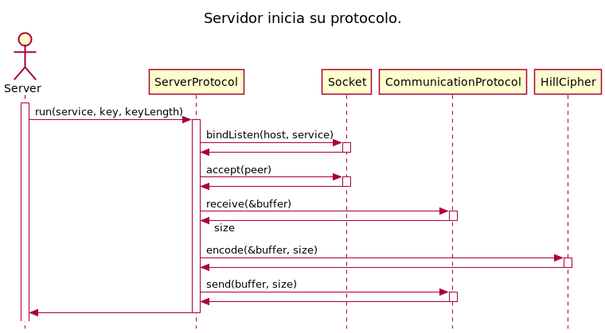

# TP1: Hill Cipher #  
**Autor: Daniel Alejandro Lovera López**  
**Número padrón: 103442**  
**[https://github.com/DanieLovera/tp1](https://github.com/DanieLovera/tp1)**  

---
### Introducción ###  
Este trabajo consiste en el desarrollo de un programa cliente-servidor  en el cual, el cliente lee línea a línea un archivo de texto plano para luego enviarlas al servidor y este se encarga de encriptarlas usando un cifrado conocido como ***Hill cipher***. Este se basa en la sustitución de caracteres usando álgebra lineal modular, es similar al cifrado Cesar (***Cesars Cipher***) porque consiste en un cifrado basado en desplazamiento de caracteres pero este  extiende el concepto a N dimensiones. Luego de que el servidor haya encriptado la línea del cliente, la devuelve y es este quien debe encargarse de desmapear (por desplazamiento) el cifrado y mostrar el resultado obtenido.
Este programa se encuentra diseñado principalmente en 4 grandes bloques que son independientes unos de otros:  
  
- **Cliente**  
- **Protocolo de comunicación**  
- **Servidor**  
- **Cifrado Hill**  
  
Cada uno de ellos también tienen cierto nivel de abstracción internamente, pero estos son los módulos claves del trabajo.  

---
### Desarrollo ###  
  
En esta sección se presentan detalles de implementación sobre los cuatro módulos principales junto con algunos diagramas que tienen como objetivo ayudarle al lector a entender el diseño propuesto.  
  
> Previo a continuar con el trabajo, el lector debe saber que los diagramas UML presentados en esta sección no son una representación exacta de la implementación que se encuentra en el repositorio. Existen diferencias en nombres, firmas, tipos de datos o simplificaciones en los diagramas de secuencias, por lo cual estos diagramas tratan de ser un poco mas genéricos y abstractos para que el diseño del programa pueda ser entendido y reproducido en cualquier otro lenguaje de programación. Por su puesto esta generalización no evita que el código presentado sea fiel a los diagramas.  
  
A continuación se presenta un diagrama UML de clases que representa al modelo y se hacen explicitos algunos modulos extras empleados en el diseño.  
  
#### Modelo del programa ####  
  

  
En este diagrama se pueden observar las relaciones entre clases y la independencia entre ellas:  
  
- Los **protocolos cliente** y **servidor** no conocen al protocolo de comunicación, su unica responsabilidad sera ejecutar los programas cliente y servidor. De la comunicación entre ellos se encarga el protocolo de comunicación quien es el que conoce como se enviarón y recibiran datos del cliente al servidor y viceversa.  
- El **protocolo cliente** debe desmapear el resultado enviado como respuesta por el servidor y para esto utiliza una  librería llamada **Maplib**, con esto se evita que el cliente conozca directamente la interfaz del **Hill Cipher** y a su vez se elimina la responsabilidad de mapear al cipher.
- El **protocolo servidor** debe cifrar el mensaje enviado por el cliente además de implementar las funciones que debe ejecutar el servidor por lo cual delega la responsabilidad del cifrado sobre el **Hill Cipher** y utilizando su interfaz pública.  
- El **protocolo de comunicación** es el encargado de conocer como se transmiten los mensajes entre ambos extremos de la comunicación e internamente debe utilizar un **Socket** para realizar efectivamente la transmisión de datos:   

    1. El protocolo de envio consiste en realizar un primer envio con la cantidad de bytes que se enviaran en formato big endian de dos bytes y luego enviar el mensaje real.
    2. El protocolo de recepción consiste en realizar una primera recepción con la cantidad de bytes que se recibiran en formato big endian de dos bytes y luego recibir el mensaje real.  

En síntesis si se quisiera reemplazar el *protocolo de comunicación* establecido se podría hacer respetando la interfaz pública de send y receive que entienden el servidor y el cliente. De la misma manera se podría cambiar el socket que se utilizó en la comunicación (en este caso un socket para TCP) y trabajar con otro protocolo de transmisión de datos sin afectar al *protocolo de comunicación* e incluso se puede cambiar el tipo de *cifrado* que utiliza el servidor, pero esto llevaría un poco de mas de trabajo pues el cliente al tener que desmapear los resultados enviados por el servidor quedo ligeramente acoplado al tipo de cifrado que se use, ya que si este utilizara otro tipo de mapeo entonces también se debería cambiar el módulo de mapeo correspondiente.  
  
#### Cliente ####  
  
El cliente es uno de los programas principales, utiliza el módulo **protocolo cliente** para iniciar su ejecución por lo cual este tiene las siguientes responsabilidades:  
  
- Conectarse al servidor conociendo el dominio y el servicio de este.  
- Leer desde un archivo de texto o por entrada estándar los datos que se enviarán al servidor.  
- Enviar los datos al servidor y esperar por una respuesta.
- Recibir los datos del servidor.
- Desmapear los datos del servidor.
- Mostrar los datos por salida estándar.

A continuación se presenta un diagrama de secuencia que representa esta secuencia de pasos a través de los distintos módulos:  
  
  
  
La única responsabilidad que le quedo al protocolo del cliente y que no fue representada en el diagrama fue, la lectura del archivo de texto o de entrada estándar. Esta consiste en utilizar la función **getline** de la biblioteca estándar de C para leer y repetir el procesamiento de (envio, recepción y desmapeo) hasta terminar el archivo pues tiene el beneficio de incluir siempre el caracter '\n' dentro de la línea leída. El resto es delegado en otros módulos.  
  
####Protocolo de Comunicación####
  
El protocolo de comunicación permite desacoplar los módulos Protocolo Cliente y Protocolo Servidor, pues si no estuviera esta interfaz en medio de ambos protocolos el Cliente sabría como enviar datos al servidor pero también tendría que saber como los recibe, y esto implica conocer como el servidor le envía respuestas a sus peticiones. Por esta razón se coloco este módulo entre ambos, para que sea el traductor entre los extremos, de esta manera el protocolo cliente y servidor solo entienden dos mensajes de la interfaz pública del protocolo de comunicación:  
  
- Enviar un flujo de datos.
- Recibir un flujo de datos.
  
Ahora cliente y servidor no saben nada de las comunicaciones de esto se encarga el protocolo de comunicación.  
  
  
  
  
  
Los diagramas de secuencia ponen de manifiesto como funciona el protocolo, internamente sigue delegando responsabilidades sobre el **Socket** y al no tener responsabilidades adicionales ni dependencias es un módulo de alto nivel y es fácil de reemplazar o extender.

#### Servidor ####  
  
El cliente es uno de los programas principales, utiliza el módulo **protocolo servidor** para iniciar su ejecución por lo cual este tiene las siguientes responsabilidades:  
  
- Bindear un socket pasivo en la máquina local sobre un servicio.
- Aceptar una conexión entrante del cliente.
- Recibir los datos del cliente.
- Cifrar los datos.
- Enviar los datos devuelta al servidor.
  
A continuación se presenta un diagrama de secuencia que representa los pasos del servidor a través de los distintos módulos:  
  
  
  
En este caso el protocolo servidor no tiene ninguna otra responsabilidad, toda es delegada, pero puede existir el problema de, ¿como obtener los datos una vez que el cifrado haya terminado? Debido a que el módulo del cipher no tiene permitido modificar los datos que quiere encriptar, entonces internamente debe implementar una forma de poder sacarlos sin generar acoplamiento, esto se solucionó con un callback que ejecutaría en protocolo del servidor pero seria llamado internamente en el cipher, en la siguiente sección se explicará este detalle.
  
#### Hill Cipher ####  
  
El cifrador junto con el **Socket** son los módulos mas complejos del programa. En ellos se concetra la mayoría de la lógica del programa, la complejidad del cipher reside en la variación del tamaño del buffer de entrada, es decir la relación entre cantidad de datos a cifrar y cantidad de datos cifrados no es 1 a 1, el resultado facilmente puede ser un buffer mas grande o mas pequeño dependiendo del tamaño de la clave o la cantidad de datos que sean filtrados del buffer inicial. Por esto motivo se decidió trabajar con memoria dinámica y además como se mencionó en la sección anterior, asegurar que el buffer de entrada al cipher no pueda ser modificado ya que no se puede enviar la codificación sobre el mismo buffer porque el resultado podría ser de mayor tamaño.  

Continuando con el tema introducido en protocolo del servidor, el hecho de no poder modificar el buffer de entrada obliga a que la implementación del cipher deba permitir extraer estos datos, y para hacerlo de forma genérica el cipher permite que cualquier módulo que requiera utilizar los datos cifrados lo pueda hacer según corresponda. En este caso el protocolo del server implemento una función que envía estos datos a través del protocolo de comunicación.

**Función que permite la salida del resultado a cualquier módulo.**
´´´
    void hill_cipher_output_result(hill_cipher_t *self, 
    							   ssize_t (*callback)(void *context, 
    										 		   const unsigned char *buffer, 
    						   						   ssize_t size), 
    							   void *context) {
    	callback(context, self->_result, self->_result_length);
    }
´´´
Esta función trabaja con un callback que solo necesita ser implementado por los módulos que requieran obtener estos datos, y cumplan con la firma acordada. El proceso del cipher se presenta en el siguiente diagrama de secuencia.  
  
  
  
Como se puede notar el proceso de cifrado delega en la biblioteca **Maplib** la responsabilidad del mapeo, esto fue necesario para evitar que el cliente accediera al cifrador unicamente por estar relacionado a su mapeo.  
  
---
### Conclusiones ###  
  
Luego de haber desarrollado el cliente-servidor, se puede decir que el tema realmente complicado fue la creación del TDA socket, ya que esta relacionado a las bibliotecas estándar de C y requiere mucho cuidado y atención para implementar correctamente las funciones que permitirán construir el cliente y el servidor. Una vez superado este problema solo queda tomar decisiones de diseño, por ejemplo, respecto a como se implementa el cipher, que en este caso se decidió usar memoria dináica sin alguna otra abstracción de por medio, que hubiese sido posible pero complicaría el diseño por las operaciones entre vectores que se tienen que realizar constantemente. Trabajando por bloques, probando cada uno de ellos de forma independiente y con cuidado se logran resultados satisfactorios y con la menor cantidad de bugs posibles cuando se pruebe en conjunto.

---
